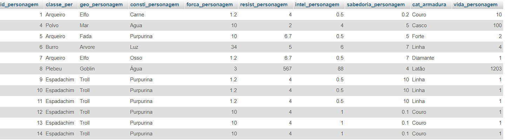

# RpgProject-Official 

Rpg Project focused on delivering a magical experience for all users around the world!
---

## Technologies Used

<table>
  <th>PHP</th>
  <th>MySQL</th>
  <th>HTML</th>
  <th>CSS</th>
</table>

---

## SQL Table

---

## Home Page

---

## Creation Page

---

## Update Page

---

## Delete Page

---

## View Page

